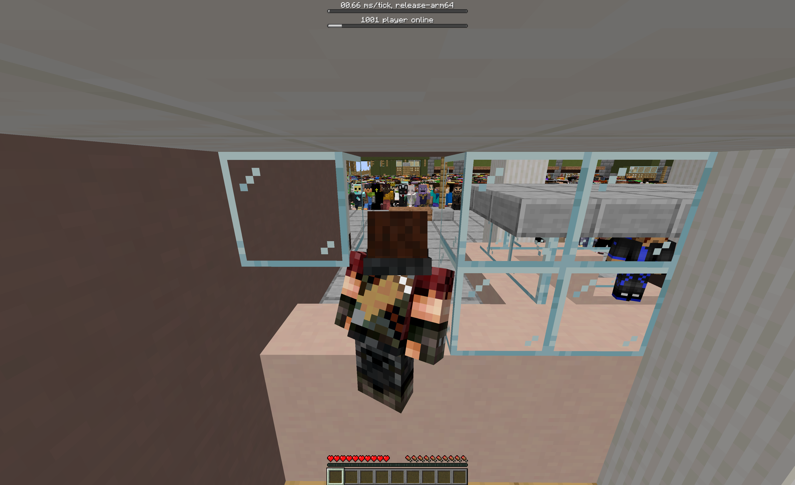

## Redefining the Limits of Multiplayer Gaming



In October 2020, EVE Online set a world record with 8,825 players in a single PvP battle. Today, we're not just raising the bar—we're shattering it. Our goal? 100,000 players in a single Minecraft world, engaged in simultaneous, seamless gameplay.

## The Current Landscape and Its Limitations

Minecraft Java Edition servers like Hypixel host tens of thousands of players, but they're spread across multiple mini-games and lobbies. Single-world interactions typically max out at a few hundred players before performance degrades significantly. This limitation stems from Minecraft's core architecture, which wasn't designed for massive concurrency.

Existing solutions like MultiPaper and Folia push these limits by implementing distributed systems and region-based parallelism, respectively. However, they're still constrained by Minecraft's fundamentally single-threaded core architecture.

## Our Groundbreaking Solution: A New Engine for Massive Multiplayer

We've built a new game engine from the ground up, designed specifically for massive multiplayer experiences. Here's a deep dive into the key technologies that make this possible:

### 1. Entity Component System (ECS) with Flecs

At the heart of our engine lies Flecs, a high-performance archetypal Entity Component System (ECS) framework.

An ECS is an architectural pattern that separates the data (Components) from the logic (Systems) that operates on that data. Entities are simply identifiers that tie components together. This separation allows for incredibly efficient data processing and memory management.

Flecs takes this concept further by offering:

- **Blazing-fast iteration**: Flecs can process millions of entities per second, thanks to its cache-friendly data layout and vectorized operations.
- **Flexible querying**: Complex queries can be constructed to efficiently select and process only the relevant entities.
- **Built-in multithreading**: Flecs provides automatic parallelization of systems, allowing us to fully utilize modern multi-core CPUs.

In practice, this means we can represent every player, mob, item, and even chunk as an entity, with components describing their properties. Systems then operate on these entities in parallel, allowing for scalability.

For example, an entity movement system might look like this:

```rust
system!(world, Position, Velocity)
    .each(|(pos, vel)| {
        pos.x += vel.x;
        pos.y += vel.y;
        pos.z += vel.z;
    });
```

This system would automatically be parallelized across all available CPU cores and process thousands of entities simultaneously.

### 2. Hybrid Server Architecture

Our architecture separates the game logic from networking concerns, allowing each to scale independently:

- **Dedicated Game Server**: This server runs the core game logic using our ECS-based engine. It's optimized for computational efficiency and can handle the game state for all 100,000+ players.

- **Horizontally Scalable Proxy Layer**: A cluster of proxy servers handles all client connections and network-related tasks. This layer can be easily scaled by adding more servers as the player count increases.

This separation allows us to optimize each part independently. The game server can focus on updating the game state as efficiently as possible, while the proxy layer handles the complexities of network communication.

### 3. Network

Our proxy system is key to enabling massive player counts:

- **Intelligent Broadcast Management**: Instead of the game server having to send updates to each player individually, it sends a single update to the proxy layer. The proxies then handle distributing this update to the relevant players.

- **Localized Updates**: Proxies are aware of player locations and can efficiently send updates only to players who need them. This drastically reduces bandwidth requirements.

- **Packet Reordering**: The proxy ensures that updates are applied in the correct order, even when they arrive out of sequence.

- **Efficient Memory Utilization**: We use thread-local buffers in the game server and zero-copy techniques to minimize memory allocation and copying, crucial for handling high packet volumes.

### 4. Optimized World Representation

To support a mutable world with 100,000+ players, we've implemented several optimizations:

The world is divided into chunks, similar to vanilla Minecraft,
but our implementation is optimized for concurrent access and updates.
All changes are event-based, where events are stored in a thread-local buffer.

## The Numbers Don't Lie


This image showcases our engine running on 12 cores, processing 1,000 players in just 455.53µs. This performance implies support for over 100,000 players in a simple event scenario.

But it's not just raw numbers. This benchmark includes:
- Basic anti-cheat measures
- Entity-block collisions
- A fully mutable world
- 8 chunk radius render distance

Let's break down what this means:

- **455.53µs for 1,000 players**: This is roughly 0.45µs per player, or about 2.2 million players processed per second on a single 12-core machine.
- **Anti-cheat measures**: We've implemented basic sanity checks and movement validation without significantly impacting performance.
- **Entity-block collisions**: Collision detection is often a major bottleneck, but our spatial partitioning system makes it efficient even at scale.
- **Mutable world**: Players can modify the world in real-time, with changes propagated efficiently to other players.
- **289 chunks per player**: This large render distance is made possible by our optimized world representation and efficient update system.

## Technical Breakthroughs and Their Implications

1. **Unparalleled Scalability**: 100,000 concurrent players in a single world—a 10x leap over the current record. This opens up possibilities for massive battles, complex economies, and social interactions at an unprecedented scale.

2. **Optimized Multi-core Utilization**: Our ECS architecture and parallel systems fully leverage modern CPU architectures. This means we can achieve high performance even on commodity hardware.

3. **Consistent Global State**: Our packet reordering system and deterministic ECS updates ensure a coherent experience for all players, crucial for competitive gameplay and complex interactions.

4. **Modular Extensibility**: The ECS architecture allows for rapid feature development. New gameplay elements can be added by simply creating new components and systems, without needing to modify the core engine.

## Built for Trust and Reliability

- **Battle-tested Technologies**: We've built on proven foundations like Flecs, ECS patterns, and RESTful principles, ensuring stability and performance.
- **Architectural Integrity**: By decoupling networking and game logic, we've created a more robust and maintainable system that can evolve with future needs.
- **Deterministic Execution**: Our ECS-based approach minimizes race conditions and ensures reproducible gameplay, crucial for competitive scenarios.
- **Granular Profiling**: Our architecture allows for detailed performance monitoring, enabling us to quickly identify and resolve any bottlenecks.

## The Future of Massive Multiplayer Gaming

We're not just pushing boundaries—we're redefining what's possible in online gaming. Imagine:

- Epic battles with tens of thousands of players, each action impacting the world in real-time.
- Vast, persistent worlds evolving through collective player actions, with economies and societies emerging organically.
- Complex, player-driven narratives unfolding at an unprecedented scale, blurring the lines between game and virtual world.

## Help Define the Future of Large-Scale Virtual Events

We're seeking visionary partners to help shape this future. Whether you're a:
- Developer eager to push technical limits and explore new paradigms in game engine design.
- Game designer envisioning new gameplay mechanics that leverage massive player counts.
- Investor or partner looking for the next big leap in gaming technology.

We want to hear from you. 

In the coming months, we'll be hosting proof-of-concept events that will demonstrate the full potential of our technology. This is your chance to be at the forefront of a gaming revolution that will redefine multiplayer experiences.

Don't just witness history—help us make it. Reach out to our team today to explore collaboration opportunities and be part of redefining the future of multiplayer gaming.